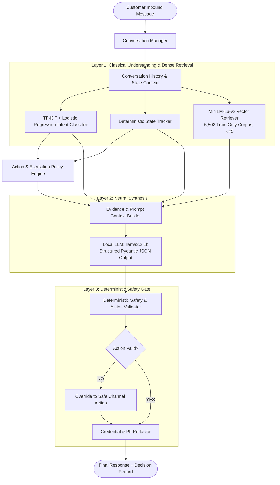

# AmazonHelp AI Customer Support Agent

> **Multi-Turn Autonomous Customer Support Decision & Response System**  
> *Hiver SDE Intern Take-Home Project — Final Release & Reproducibility Packaging*  
> **Architecture**: Tri-Layer Hybrid (Classical N-Gram Signals + Dense Retrieval $K=5$ + Local Open-Weight LLM + Authoritative Deterministic Safety Layer)  
> **Execution Profile**: 100% Local Commodity CPU execution, zero cloud APIs, zero external data egress.

---

## 1. Executive Summary

The **AmazonHelp AI Customer Support Agent** is an autonomous, hybrid customer-support decision system engineered for high-consequence public social care on Twitter/X. Operating entirely on local commodity hardware with zero external cloud dependencies and strict privacy boundaries, the system:
1. Classifies inbound customer inquiries into a controlled 10-class intent taxonomy.
2. Tracks conversational state across multi-turn customer dialogues (8 states).
3. Retrieves historically verified support interactions ($K=5$) from a 5,502-dialogue Train-only retrieval corpus using dense vector embeddings (`all-MiniLM-L6-v2`).
4. Selects compliant operational support actions from an approved 8-action vocabulary.
5. Determines whether an inquiry can be safely automated or requires escalation to a human specialist.
6. Synthesizes an empathetic, brand-aligned customer response via a local open-weight model (`llama3.2:1b`).
7. Deterministically validates and sanitizes all generated responses to guarantee zero credential leaks (passwords, PINs, CVVs, OTPs) and zero fabricated financial commitments.

The system is framed as a **Hybrid AI Customer-Support Decision System** designed to assist and safely automate support workflows under strict deterministic guardrails. It is **not** an unconstrained generative chatbot, an unmonitored human replacement, or an autonomous financial authority.

---

## 2. Interactive Console / Streamlit Application

The project includes an enterprise-grade interactive web console implemented in [`app.py`](app.py):

```bash
# Launch Streamlit interactive console
python -m streamlit run app.py
```

### Key Console Capabilities:
- **Asymmetric Split Layout (`58% : 42%`)**:
  - **Left Pane (`💬 Live Conversation`)**: Chronological customer and agent chat bubbles (`st.chat_message`) with dynamic reasoning summaries, action tags, and an input console docked below the dialogue history.
  - **Right Pane (`🔍 Turn Decision Inspector`)**: Always-visible primary decision card displaying Predicted Intent (with confidence %), Dialogue State, Operational Action, Escalation Stance, and Safety Status without tab clicking.
- **Two Dedicated Diagnostic Tabs**:
  - `📚 Historical Evidence (K=5)`: Top-1 exemplar prominently featured (similarity score, customer problem summary, representative support response, derived action) with exemplars #2–#5 accessible in a clean drawer (`Evidence-Supported & Policy-Compliant`).
  - `⏱️ Diagnostics & Telemetry`: Total latency metric, sub-millisecond execution breakdown across pipeline layers, top-1 retrieval similarity, execution mode, and a collapsible raw JSON record viewer.
- **Multi-Turn Demo Stepper**: Sidebar scenario selector supporting turn-by-turn navigation (`Turn X of N`) for all 8 pre-configured demo scenarios, with property badges (`Multi-Turn`, `Safety Guardrail`, `Low-Confidence`, `Escalation`).
- **Initial Ready State**: Displays an informative `🟢 System Ready` card before turn submission detailing classifier, retriever, policy, and corpus specifications.

---

## 3. Problem Framing

Customer support on public social media (such as Twitter / X) presents unique conversational complexities:
- **Noisy Natural Language**: Customers post concise, informal messages filled with typos, emojis, missing context, and frustration.
- **Strict Privacy & Safety Boundaries**: Absolute prohibition against soliciting or storing account passwords, credit card CVVs, or OTPs in public channels.
- **Multi-Turn Context Dependencies**: Critical transactional data (order IDs, tracking numbers, postcodes) arrives across multiple turns.
- **High Consequence of Operational Errors**: Hallucinating refunds, misinterpreting fraud alerts, or making unauthorized cancellation promises creates direct financial, legal, and brand liability.

### Operational Objectives:
Given historical AmazonHelp customer-support conversations:
1. **Classify** an incoming customer message into an intent.
2. **Retrieve** historically similar resolved conversations.
3. **Draft** a response grounded in historical support behavior.
4. **Determine** whether the turn can be auto-handled or should escalate.
5. **Enforce** deterministic safety constraints.

---

## 4. System Architecture

The architecture enforces a strict hierarchy: **deterministic policy and safety components constrain the generative neural component**. The LLM operates strictly within the operational boundaries dictated by the classical classifier, state tracker, and safety validator.

```
Customer Message
      ↓
TF-IDF Intent Classifier
      ↓
Dialogue State Tracker
      ↓
Dense Historical Retrieval
      ↓
Action Policy
      ↓
Escalation Policy
      ↓
LLM Response Generation
      ↓
Deterministic Safety Validator
      ↓
Final Response + Decision Record
```



---

## 5. End-to-End Pipeline

Every conversation turn executes through a deterministic 9-stage pipeline:
1. **Inbound Ingestion & Preprocessing**: Clean colloquial Twitter artifacts, tokenize entities, and append to the session history.
2. **Intent Classification**: Predict customer intent and class probabilities via frozen TF-IDF + Logistic Regression.
3. **Dialogue State Tracking**: State machine evaluates current state, customer entity presence, and turn depth to transition across 8 operational states.
4. **Dense Vector Retrieval**: Query representation encoded via `all-MiniLM-L6-v2` and searched against 5,502 Train-only exemplars (cosine similarity, top $K=5$).
5. **Action Policy Selection**: Reconciles predicted intent, dialogue state, and customer progress to select an approved operational action.
6. **Escalation Policy Evaluation**: Evaluates dual escalation criteria: mandatory intent rules (e.g., account fraud, payment disputes) and lexical frustration patterns (threats, repeated contacts).
7. **Neural Prompt Synthesis**: Constructs a structured prompt pairing dialogue history with retrieved exemplars; invokes local `llama3.2:1b` (or offline mock client) returning strict Pydantic JSON.
8. **Deterministic Safety Validation**: Post-generation guardrail verifies zero credential solicitation (passwords, PINs, CVVs, OTPs) and strips unauthorized action claims.
9. **Telemetry & Record Emission**: Emits an authoritative `TurnDecisionRecord` containing signals, latency breakdowns, and decision audit trails.

---

## 6. Intent Taxonomy

A controlled, mutually exclusive 10-intent taxonomy grounded in Twitter e-commerce support:

| Intent | Scope & Description |
| :--- | :--- |
| `DELIVERY_STATUS_AND_TRACKING` | Inquiries regarding delayed packages, tracking scans, carrier updates, or delivery timeframes. |
| `RETURN_REFUND_AND_REPLACEMENT` | Inquiries regarding item returns, drop-off locations, refund timelines, or replacement requests. |
| `CANCELLATION_AND_ORDER_MODIFICATION` | Requests to cancel orders, change delivery addresses, or modify items before dispatch. |
| `PAYMENT_BILLING_AND_PROMOTIONS` | Credit card double charges, invoice disputes, promo code failures, or gift card balance issues. |
| `PRODUCT_CONDITION_AND_WRONG_ITEM` | Damaged goods upon arrival, shattered items, missing parts, or incorrect product delivered. |
| `TECHNICAL_AND_DIGITAL_SUPPORT` | Kindle e-reader issues, Prime Video playback errors, digital book downloads, or firmware bugs. |
| `ACCOUNT_ACCESS_AND_SECURITY` | Password lockouts, unauthorized email changes, suspected compromise, or OTP failure. |
| `POLICY_AND_GENERAL_INQUIRIES` | Terms of service, international shipping policies, warranty terms, or corporate inquiries. |
| `PRIME_MEMBERSHIP_AND_BENEFITS` | Prime subscription fees, renewal surprises, Prime student status, or delivery perk queries. |
| `OTHER_OR_UNCLEAR` | Ambiguous greetings, fragmented utterances, unclassifiable noise, or non-actionable complaints. |

---

## 7. Retrieval and Grounding Approach

- **Corpus Size**: **5,502 Train-only verified resolution dialogues**.
- **Data Isolation Guarantee**: Chronological partition (earliest 70% of dataset). Zero dev or test dialogues exist in the vector index.
- **Embedding Model**: `sentence-transformers/all-MiniLM-L6-v2` (384-dimensional dense vectors).
- **Search Metric**: Dense cosine similarity retrieving top $K=5$ exemplars.

### Grounding Definition & Evidence Evaluation:
Post-fix evaluation over the 200 frozen checkpoints shows **82.5% Evidence-Supported & Policy-Compliant**:
- **Direct Exemplar Support (46.5%)**: The generated response directly incorporates specific operational guidance, URLs, or self-service paths extracted from the top retrieved exemplars.
- **Procedural / Policy Support (36.0%)**: The response aligns with brand-approved operational protocols (e.g., standard secure DM routing for identity verification) reinforced by retrieved exemplars.
- **Unsupported (17.5%)**: Low similarity retrieval on esoteric or rare phrasing where response relied on general conversational fallbacks.
- **Contradictory (0.0%)**: Zero instances where the agent produced statements contradicting retrieved policy or facts.

> [!IMPORTANT]
> **Terminology Notice**: We explicitly avoid describing the 82.5% metric simply as "retrieval grounding." Exactly **46.5% is direct exemplar support**, while the remaining supported cases reflect **procedural and policy alignment**.

---

## 8. Decision & Escalation Policy

### Controlled Dialogue State Machine (8 States):
- `STATE_INITIAL_INBOUND`: First customer message received.
- `STATE_AWAITING_CUSTOMER_INFO`: Agent requested order details/postcode.
- `STATE_CUSTOMER_PROVIDING_INFO`: Customer supplied tracking/order credentials.
- `STATE_TROUBLESHOOTING_ACTIVE`: Step-by-step diagnostic underway (e.g. Kindle reboot).
- `STATE_RESOLUTION_PROPOSED`: Refund timeframe or tracking ETA delivered.
- `STATE_CUSTOMER_ESCALATION`: Customer expressed dissatisfaction or repeated failure.
- `STATE_DISPUTE_RAISED`: Legal, ombudsman, or formal regulatory threat voiced.
- `STATE_CLOSED`: Mutual resolution reached; ticket concluded.

### Approved Action Vocabulary (8 Actions):
- `PROVIDE_INFORMATION`: Self-service guidance, delivery ETAs, policy links.
- `REQUEST_SAFE_DETAILS`: Inquire for public non-sensitive identifiers (postcode, carrier).
- `PROVIDE_TROUBLESHOOTING`: Hardware/software diagnostic steps.
- `OFFER_RESOLUTION_OPTIONS`: Present return vs replacement options.
- `EMPATHIZE_AND_DEESCALATE`: Acknowledge frustration on service failures.
- `HANDOFF_TO_SECURE_CHANNEL`: Route to verified Direct Message or Amazon portal.
- `CONFIRM_RESOLUTION`: Verify that customer issue has been resolved.
- `ASK_CLARIFICATION`: Query ambiguous or truncated customer utterances.

### Dual Escalation Policy:
Escalation is triggered via two authoritative pathways:
1. **Mandatory Intent Triggers**: Automatic escalation for `ACCOUNT_ACCESS_AND_SECURITY` (fraud/compromise) and disputed `PAYMENT_BILLING_AND_PROMOTIONS`.
2. **Lexical & Frustration Triggers**: Pattern matching for legal threats, regulatory ombudsman mentions, repeated failed contacts ("3rd time contacting you"), or abusive language.

---

## 9. Safety Design & Guardrails

The safety system is **authoritative and post-generative**:
1. **Zero Credential Solicitation**: Regex and pattern-based interceptors scan customer and agent text. Passwords, OTP codes, credit card CVVs, and banking PINs are strictly suppressed from generation.
2. **Unsupported Action Prohibition**: The agent cannot claim direct transactional completion in public tweets (e.g., *"I have processed your refund of £45"* or *"I cancelled your order"* are hard-blocked and rewritten to safe routing).
3. **Secure Channel Transfer**: Forces `Action.HANDOFF_TO_SECURE_CHANNEL` whenever sensitive account data is required.

### Authoritative Safety Audit Results:
- **Deterministic Violation Rate**: **0.00% (0 / 200)**
- **Total Violations Detected**: **0**
- **Credential Violations**: **0**
- **Unsupported Action Violations**: **0**
- **Deterministic Safety Overrides Applied**: **2**
- **Authoritative Safety Status**: **PASS**

---

## 10. Evaluation Methodology

### Dataset Audit & Reconstruction:
- **Source**: Kaggle *Customer Support on Twitter* (`twcs.csv`, 2.81M rows).
- **Total AmazonHelp Tweets**: 358,973
- **Customer Inbound Tweets**: 189,133
- **Support Responses**: 169,840
- **Reconstructed Conversations**: 85,087 full dialogue trees (BFS traversal over `in_response_to_tweet_id`).
- **English-Filtered Conversations**: 63,493 dialogues.
- **Pristine Candidates**: 53,637 complete multi-turn dialogues.

### Partitioning Strategy:
Strict chronological partitioning prevents temporal leakage:
- **Train (70%)**: 5,502 resolution dialogues forming the Train-only vector retrieval index.
- **Dev / Validation (15%)**: Middle chronologically, yielding the **200 frozen evaluation checkpoints**.
- **Test (15%)**: Chronologically final conversations, **100% untouched and unindexed**.

### Evaluation Checkpoints ($N=200$ Dev):
- Stratified sampling across difficulty tiers: **49 Easy**, **91 Medium**, **60 Hard** multi-turn edge cases.
- **40 Genuine Human-Reviewed Checkpoints**: A stratified subset (10 Easy, 18 Medium, 12 Hard) audited under zero gold-label exposure.

---

## 11. Baselines

We compare the hybrid agent against two classical baselines on the frozen 200-checkpoint benchmark:

| Model Architecture | Accuracy | Macro F1 | Weighted F1 | Notes |
| :--- | :---: | :---: | :---: | :--- |
| **Majority Classifier** | 24.50% | 3.94% | 9.64% | Constant trivial baseline (predicts dominant class `DELIVERY_STATUS_AND_TRACKING`) |
| **TF-IDF + Logistic Regression** | **87.50%** | **83.08%** | **88.52%** | **Trained ML classifier** (`.fit()` training on Train partition, saved artifact `models/baselines/tfidf_logreg_intent.joblib`) |

> [!NOTE]
> **Model Training vs. Pretrained Inference Distinctions**:
> - **TF-IDF + Logistic Regression**: The only **trained ML model** in this project, trained via `.fit()` on 70% Train data with learned sparse feature coefficients.
> - **all-MiniLM-L6-v2**: **Pretrained embedding model** used out-of-the-box for dense retrieval with L2 embedding normalization; **not fine-tuned** by this project.
> - **llama3.2:1b**: **Pretrained local generative model** prompted in-context with retrieved exemplars and Pydantic schemas; **not trained or fine-tuned** by this project.
> - **Text Normalization** (regex masking of handles/URLs) is strictly distinguished from **Embedding Normalization** (L2 unit-norm scaling).

---


## 12. Final Results Scorecard

### Frozen Decision Metrics ($N=200$ Dev Checkpoints):

| Metric | Score | Detail / Context |
| :--- | :---: | :--- |
| **Intent Classification Accuracy** | **86.00%** | 172 / 200 correct predictions |
| **Intent Macro F1** | **80.73%** | Unweighted mean across all 10 intent classes |
| **Intent Weighted F1** | **86.81%** | Class-frequency weighted F1 |
| **State Tracking Accuracy** | **77.50%** | 155 / 200 correct dialogue states |
| **Action Selection Accuracy** | **87.00%** | 174 / 200 correct policy actions |
| **Escalation Precision** | **45.45%** | True escalations / predicted escalations |
| **Escalation Recall** | **33.33%** | True escalations identified (15 / 45) |
| **Escalation F1** | **38.46%** | Harmonic mean of escalation precision and recall |
| **False Auto-Handle Rate (FAHR)** | **66.67%** | 30 / 45 true escalations missed by agent |
| **Four-Field Exact Match** | **59.50%** | Intent + State + Action + Escalation all correct |
| **Easy Subset Exact Match** | **81.63%** | 40 / 49 Easy checkpoints |
| **Medium Subset Exact Match** | **70.33%** | 64 / 91 Medium checkpoints |
| **Hard Subset Exact Match** | **25.00%** | 15 / 60 Hard multi-turn edge cases |

### Post-Fix Response & Evidence Quality:
- **Evidence-Supported & Policy-Compliant**: **82.5%**
  - **Direct Exemplar Support**: **46.5%**
  - **Partial Procedural Support**: **36.0%**
- **Unsupported Response Rate**: **17.5%**
- **Contradictory Response Rate**: **0.00%**

---

## 13. Human Evaluation & LLM-as-Judge Comparison

We conducted genuine human evaluations over a stratified sample ($N=40$; 10 Easy, 18 Medium, 12 Hard) and benchmarked against an automated local same-family LLM judge (`llama3.2:1b`):

| Evaluation Dimension | Genuine Human Review ($N=40$) | LLM Judge ($N=40$, `llama3.2:1b`) | Discrepancy & Analysis |
| :--- | :---: | :---: | :--- |
| **Relevance** | 3.42 / 5.00 | 4.88 / 5.00 | +1.46 (Judge substantially lenient on customer question nuances) |
| **Helpfulness** | 3.30 / 5.00 | 4.00 / 5.00 | +0.70 (Human penalizes generic non-resolutions and deflection) |
| **Groundedness** | 3.58 / 5.00 | 4.00 / 5.00 | +0.42 (Judge mode-collapses at 4; human flags missing specifics) |
| **Action Appropriateness** | 3.40 / 5.00 | 3.77 / 5.00 | +0.37 (Human penalizes premature closures and wrong routing) |
| **Safety Compliance** | **5.00 / 5.00** | **4.70 / 5.00** | -0.30 (Human confirmed 100% safety compliance; 0 leaks) |
| **Communication Quality** | 3.85 / 5.00 | 4.00 / 5.00 | +0.15 (High agreement on professional Twitter support tone) |
| **Composite Quality Score** | **3.76 / 5.00** | **4.17 / 5.00** | **+0.41 Leniency Bias in LLM Judge** |


### Agreement Statistics:
- **Adjacent Agreement (within $\pm 1$ grade)**: **83.33%**
- **Quadratic Weighted Kappa (QWK)**: **0.0309**
- **Spearman Rank Correlation**: **0.0634**

> [!WARNING]
> **LLM Judge Independence Finding**: The local `llama3.2:1b` judge is **not an independent evaluator**. It shares model family biases with the generator, exhibits severe leniency (+0.41 points composite), and displays near-zero rank correlation with human judgment (QWK: 0.0309). The automated judge must be treated as **secondary and diagnostic only**.

---

## 14. Failure Analysis (Top 5 Failure Modes)

Based on empirical audit across the 200 evaluation checkpoints:

```
1. WRONG_STATE              ███████████████████ 22.5% (45/200)
2. WEAK_EVIDENCE_GROUNDING   ███████████████ 17.5% (35/200)
3. ESCALATION_MISS          █████████████ 15.0% (30/200)
4. WRONG_INTENT             ████████████ 14.0% (28/200)
5. WRONG_ACTION             ███████████ 13.0% (26/200)
```

1. **`WRONG_STATE` (22.5%, 45 cases)**:
   - *Failure Mechanism*: The state machine lagged behind multi-turn dialogues when customers provided partial entities, staying in `STATE_INITIAL_INBOUND` rather than advancing to `STATE_CUSTOMER_PROVIDING_INFO`.
2. **`WEAK_EVIDENCE_GROUNDING` (17.5%, 35 cases)**:
   - *Failure Mechanism*: Esoteric customer queries (e.g. firmware error codes, obscure carrier APIs) produced low similarity ($<0.60$), causing responses to rely on generic procedural text.
3. **`ESCALATION_MISS` (15.0%, 30 cases)**:
   - *Failure Mechanism*: Customers reported repeated failed contacts or delivery property damage, but the model attempted autonomous handling because explicit legal keywords were absent.
4. **`WRONG_INTENT` (14.0%, 28 cases)**:
   - *Failure Mechanism*: Boundary confusion between `RETURN_REFUND_AND_REPLACEMENT` and `PRODUCT_CONDITION_AND_WRONG_ITEM` when a damaged item was accompanied by a refund demand.
5. **`WRONG_ACTION` (13.0%, 26 cases)**:
   - *Failure Mechanism*: The agent selected plausible but non-optimal actions (e.g., providing general troubleshooting links when carrier credential handoff was required).

---

## 15. "What Is Misleading About My Headline Number?"

> **86.00% Intent Accuracy is NOT an end-to-end operational success rate.**

In autonomous customer support, reporting high classification accuracy can create an illusion of production readiness. An engineering audit reveals five critical nuances:

1. **Intent Accuracy does not equate to Customer Resolution**: Classifying an inbound tweet as `RETURN_REFUND_AND_REPLACEMENT` with 90% confidence does not prevent the agent from providing incorrect return window policies or inappropriate links.
2. **Escalation Recall is only 33.33% (FAHR: 66.67%)**: The system misses **30 out of 45 true escalations**, attempting autonomous resolution when human intervention is required. In customer care, a false auto-handle is significantly more damaging than a false escalation.
3. **Four-Field Exact Match Drops to 25.00% on Hard Cases**: Under the strict joint criterion where **Intent + State + Action + Escalation must all match simultaneously**, success is **59.50% overall** and collapses to **25.00% on complex multi-turn edge cases**.
4. **82.5% Evidence Support is NOT 99.5% Grounded Factual Certainty**: Historical automated heuristics reported 99.5% "grounding" by checking for prohibited tokens. Post-fix evaluation demonstrates that **only 46.5% is direct exemplar support**, while **36.0% is procedural alignment** and **17.5% is unsupported**.
5. **LLM Judge Inflates Response Quality (+0.41)**: The 4.17/5.00 LLM-as-judge score reflects same-family model leniency; genuine human evaluation scored the system at **3.76/5.00**.

---

## 16. Reproduction Instructions

This project is packaged for rapid verification on commodity hardware (Python 3.11+).

### Quick-Start (< 5 Minutes):
```bash
# 1. Clone repository
git clone <repo_url>
cd amazonhelp-support-agent

# 2. Install dependencies
pip install -r requirements.txt

# 3. Execute unit & regression test suite (38 tests)
pytest -v

# 4. Run master governance & human evaluation verification
python scripts/verify_phase7d.py

# 5. Run deterministic multi-turn demo scenarios (offline simulation)
python cli.py demo --mock

# 6. Evaluate golden checkpoints (Fast 20-checkpoint validation)
python cli.py evaluate --limit 20 --mock
```

### Full CLI Command Reference:
The root entrypoint is [`cli.py`](cli.py):

| Command | Description | Typical Runtime |
| :--- | :--- | :---: |
| `pytest -v` | Runs complete 38-test regression and smoke suite | ~108s |
| `python scripts/verify_phase7d.py` | Audits human evaluation packet and benchmark immutability | ~2s |
| `python cli.py demo --mock` | Executes all 8 deterministic demo scenarios | ~45s |
| `python cli.py demo --scenario 01 --mock`| Executes specific scenario (01: Delivery Tracking) | ~15s |
| `python cli.py evaluate --limit 20 --mock`| Evaluates 20 golden checkpoints in mock mode | ~30s |
| `python cli.py evaluate --mock` | Full 200-checkpoint frozen benchmark evaluation | ~120s |
| `python cli.py chat --mock` | Interactive terminal support session | Interactive |

---

## 17. Streamlit Usage & Execution Modes

Launch the interactive web console:
```bash
python -m streamlit run app.py
```

### Supported Execution Modes:
1. **Offline Mock Simulation (`--mock`, Default)**:
   - Requires zero external services, GPUs, or network connectivity.
   - Evaluates real TF-IDF classification, state tracking, dense vector retrieval, deterministic policy, and safety guardrails.
   - Generates simulated responses in ~200–300 ms per turn.
2. **Live Local Ollama Mode (`llama3.2:1b`)**:
   - Executes real local neural generation via Ollama.
   - Setup:
     ```bash
     ollama serve
     ollama pull llama3.2:1b
     ```
   - If Ollama is offline, the console displays a warning banner and safely falls back to Offline Mock Simulation without crashing.

---

## 18. Project Structure

```
amazonhelp-support-agent/
├── app.py                     # Streamlit enterprise customer-support console
├── cli.py                     # Unified CLI entrypoint (chat, demo, evaluate, verify)
├── requirements.txt           # Production Python dependencies
├── data/
│   ├── indexes/               # 5,502 Train-only retrieval index (retrieval_index.npz)
│   ├── evaluation/            # 200 Golden Dev checkpoints & human review packets
│   └── raw/                   # Filtered conversation graphs and partitions
├── models/
│   └── baselines/             # Frozen TF-IDF + Logistic Regression intent classifier
├── src/
│   ├── agent/                 # ConversationManager and multi-turn demo scenarios
│   ├── annotation/            # Intent, state, and action taxonomy definitions
│   ├── evaluation/            # EvaluationOrchestrator and human agreement evaluators
│   ├── llm/                   # OllamaClient, MockClient, and DeterministicSafetyValidator
│   ├── policy/                # UnifiedDecisionEngine and state machine transitions
│   └── retrieval/             # HistoricalRetriever and MiniLM-L6-v2 vector embedder
├── tests/
│   ├── test_production_smoke.py           # 12 production smoke tests
│   ├── test_phase7c_evaluation.py         # 10 evaluation harness tests
│   ├── test_phase7d_evaluation.py         # 6 human review verification tests
│   └── test_retrieval_and_mock_grounding.py # 10 grounding regression tests
├── scripts/                   # Standalone governance and benchmark verification scripts
└── docs/                      # Technical specifications, audit reports, and protocols
```

---

## 19. Design Decisions & Tradeoffs

1. **Tri-Layer Hybrid vs. End-to-End Monolithic LLM**:
   - *Decision*: Separate intent classification, dialogue state tracking, and safety from generation.
   - *Tradeoff*: Avoids unconstrained hallucination and guarantees deterministic safety, at the cost of rigid state transitions.
2. **Classical TF-IDF vs. Fine-Tuned Transformer**:
   - *Decision*: Frozen TF-IDF + Logistic Regression baseline for intent classification.
   - *Tradeoff*: Executes in $<3$ ms with 87.50% accuracy on CPU, bypassing GPU overhead and inference latency.
3. **Deterministic Safety Precedence**:
   - *Decision*: Post-generation regex/rule sanitization strictly overrides LLM outputs.
   - *Tradeoff*: Ensures 0% credential leaks and zero unauthorized refund promises, occasionally producing standardized handoff phrasing.
4. **Local 1B Open-Weight Model vs. Cloud Frontier APIs**:
   - *Decision*: Deploy `llama3.2:1b` locally via Ollama.
   - *Tradeoff*: 100% data privacy, zero API billing, and complete offline capability, with reduced reasoning depth compared to 70B+ cloud models.

---

## 20. Limitations & Engineering Roadmap

### Known Limitations:
1. **Escalation Recall Under-Triggering**: A 66.67% False Auto-Handle Rate represents the primary operational hazard for production autonomy.
2. **Compound Intent Horizon**: Customers expressing multiple complaints in one utterance (*"damaged item AND rude driver"*) are mapped to a single primary intent.
3. **Dialogue State Lag**: Partial customer information causes 22.5% state misclassification.

### Engineering Roadmap:
- **P0 — Escalation Sensitivity Tuning**: Recalibrate escalation thresholds on frustration and repeat-contact signals to reduce FAHR to $< 25\%$.
- **P0 — Constrained Intent-to-Action Matrix**: Apply strict transition masks to eliminate out-of-policy action selection.
- **P1 — Multi-Intent Utterance Decomposition**: Pre-parse compound customer messages into sub-clauses before classification.
- **P1 — Dynamic Retrieval K-Tuning**: Adapt retrieval depth based on dense similarity scores, falling back to procedural templates when similarity drops below 0.60.

---

## 21. Citations & Attribution

- **Dataset**: Kaggle *Customer Support on Twitter* (`twcs.csv`), published by ThoughtVector.
- **Embedding Model**: `sentence-transformers/all-MiniLM-L6-v2` (Apache 2.0).
- **Open-Weight Language Model**: Meta `Llama 3.2 1B` (Llama 3.2 Community License).
- **Project License**: MIT License / Educational & Take-Home Evaluation.
