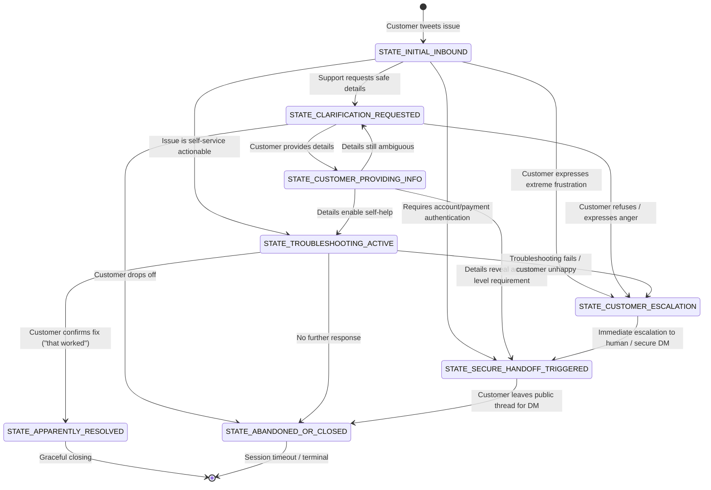

# Conversation State Machine Proposal

> **Empirical Multi-Turn Dialogue State Taxonomy for Autonomous Support Agents**  
> *Derived from Real Trajectory Analysis of 85,087 AmazonHelp Conversational Threads*

---

## 1. Motivation & Empirical Foundations

Traditional chatbot dialogue models often rely on simplistic `Greeting -> SlotFilling -> Answer -> Goodbye` flows. In contrast, Twitter customer support interactions on `@AmazonHelp` exhibit specific structural realities:
1. **Public vs. Private Tension**: Sensitive issues (order modifications, account security, refunds) cannot be executed in public and must cleanly transition to secure channels.
2. **Clarification Bottlenecks**: Customers frequently state symptoms ("my order didn't arrive") without specifying essential parameters (e.g., whether tracking shows delivered, carrier name, or international storefront).
3. **Escalation & Repeated Contact**: Over 6.8% of conversations contain explicit repeated-contact signals ("already called support twice") requiring immediate de-escalation rather than repetitive basic queries.

This document defines a **minimal, deterministic 8-state dialogue state machine**.

---

## 2. Conversation State Transition Diagram

---

## 3. State Definitions & Transition Criteria

### 1. `STATE_INITIAL_INBOUND`
- **Definition**: Entry state representing the customer's opening statement of problem, complaint, or question.
- **Entry Conditions**: Conversation root tweet received from customer (`inbound == True`).
- **Exit Conditions**: Agent analyzes intent, detects escalation/frustration markers, and selects initial response action.
- **Real Example**:
  > *"@AmazonHelp where's my order? 026-5974794-2685140"* (Tweet ID: `420039`)
- **Transitions**:
  - To `STATE_CLARIFICATION_REQUESTED`: If order number, storefront, or tracking context is missing.
  - To `STATE_TROUBLESHOOTING_ACTIVE`: If inquiry is public knowledge or self-service troubleshooting.
  - To `STATE_SECURE_HANDOFF_TRIGGERED`: If customer mentions unauthorized account charges or password lockout.
  - To `STATE_CUSTOMER_ESCALATION`: If message contains legal threats, abusive frustration, or repeated-contact signals.

---

### 2. `STATE_CLARIFICATION_REQUESTED`
- **Definition**: The agent has asked the customer for safe, non-PII diagnostic information or contextual clarification.
- **Entry Conditions**: Agent emits action `ASK_CLARIFICATION` or `REQUEST_SAFE_DETAILS`.
- **Exit Conditions**: Customer responds with data, customer ignores request, or customer escalates.
- **Real Example**:
  > *"@217247 To clarify, are you located in India or accessing Prime Video from abroad? Let us know so we can assist. ^CB"*
- **Transitions**:
  - To `STATE_CUSTOMER_PROVIDING_INFO`: When customer provides the requested parameters.
  - To `STATE_CUSTOMER_ESCALATION`: If customer responds angrily ("Why do you need that, just fix it!").
  - To `STATE_ABANDONED_OR_CLOSED`: No customer reply within the observation window.

---

### 3. `STATE_CUSTOMER_PROVIDING_INFO`
- **Definition**: The customer has supplied answers or additional context following a support inquiry.
- **Entry Conditions**: Customer turn received following `STATE_CLARIFICATION_REQUESTED`.
- **Exit Conditions**: Agent evaluates supplied information and determines next step.
- **Real Example**:
  > *"@AmazonHelp I'm accessing from the UK on a Samsung Smart TV, running the latest app version."*
- **Transitions**:
  - To `STATE_TROUBLESHOOTING_ACTIVE`: If the provided info allows definitive guidance.
  - To `STATE_SECURE_HANDOFF_TRIGGERED`: If customer reveals an account-specific problem (e.g. order cancelled by risk team).
  - To `STATE_CLARIFICATION_REQUESTED`: If supplied information is still incomplete or invalid.

---

### 4. `STATE_TROUBLESHOOTING_ACTIVE`
- **Definition**: The agent has delivered concrete procedural steps, self-service links, or diagnostic instructions.
- **Entry Conditions**: Agent emits action `PROVIDE_TROUBLESHOOTING` or `PROVIDE_INFORMATION`.
- **Exit Conditions**: Customer reports success, reports failure, or terminates dialogue.
- **Real Example**:
  > *"@116316 Please restart your Fire TV stick by holding the Select and Play/Pause buttons together for 5 seconds. Let us know if the issue persists. ^MK"*
- **Transitions**:
  - To `STATE_APPARENTLY_RESOLVED`: Customer verifies that the solution worked.
  - To `STATE_CUSTOMER_ESCALATION`: Customer reports that steps failed and expresses exasperation.
  - To `STATE_SECURE_HANDOFF_TRIGGERED`: Customer requests human intervention.
  - To `STATE_ABANDONED_OR_CLOSED`: Customer does not respond further.

---

### 5. `STATE_SECURE_HANDOFF_TRIGGERED`
- **Definition**: The agent has directed the customer to private Direct Message (DM) or authenticated customer service portal to handle sensitive account/financial actions.
- **Entry Conditions**: Detection of PII necessity, refund execution, account security, or agent action `HANDOFF_TO_SECURE_CHANNEL`.
- **Exit Conditions**: Customer acknowledges handoff and moves to private channel, or asks how to DM.
- **Real Example**:
  > *"@116319 I'm sorry it hasn't arrived! Please reach us here: https://t.co/e6dQwzp386, so we can look into available options in your account. ^SJ"*
- **Transitions**:
  - To `STATE_ABANDONED_OR_CLOSED`: Public thread terminates as customer moves to secure session.
  - To `STATE_CUSTOMER_PROVIDING_INFO`: If customer asks clarification about using the link.

---

### 6. `STATE_CUSTOMER_ESCALATION`
- **Definition**: The customer displays severe dissatisfaction, uses abusive/hostile language, invokes legal/regulatory remedies (BBB, lawyer), or reports repeated failed contacts.
- **Entry Conditions**: Regex match on `RE_ESCALATION_PHRASES` or customer explicitly rejects previous support attempts.
- **Exit Conditions**: Agent executes de-escalation protocol and immediately routes to human supervisor via secure channel.
- **Real Example**:
  > *"Worst experience in shopping no product no refund , been 40 days. F&@694 it @115821"* (Tweet ID: `9767`)
- **Transitions**:
  - To `STATE_SECURE_HANDOFF_TRIGGERED`: Forced immediate transfer to human support specialist.

---

### 7. `STATE_APPARENTLY_RESOLVED`
- **Definition**: The customer explicitly confirms their problem has been answered, fixed, or satisfactorily closed.
- **Entry Conditions**: Customer turn containing positive resolution acknowledgment (`RE_RESOLVED_SIGNALS`) without negative qualifiers.
- **Exit Conditions**: Support offers polite closing acknowledgment.
- **Real Example**:
  > - **Customer**: *"@AmazonHelp Thank you. That worked!"*  
  > - **AmazonHelp Support**: *"@217247 You're very welcome! Let us know if you need anything else. :) ^GS"*
- **Transitions**:
  - Terminal state (session complete).

---

### 8. `STATE_ABANDONED_OR_CLOSED`
- **Definition**: Interaction has ended without explicit customer resolution confirmation, typically following an informational reply, DM link, or customer timeout.
- **Entry Conditions**: Session timeout or post-handoff silence.
- **Transitions**:
  - Terminal state.
