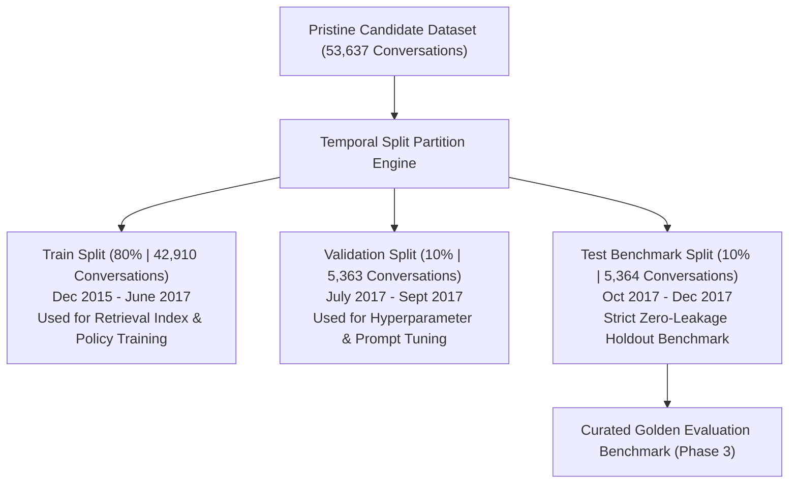

# Dataset Leakage Analysis & Evaluation Splitting Strategy

> **Evaluation Methodology Directive: Leakage Prevention, Partitioning Tradeoffs, and Benchmark Split Definition**  
> *AmazonHelp Benchmark Dataset (53,637 Pristine Multi-Turn Dialogues)*

---

## 1. Executive Summary of Leakage Audit

Prior to training classifiers, building retrieval indices, or fine-tuning dialogue models in subsequent phases, an exhaustive empirical audit was conducted on the pristine AmazonHelp candidate dataset (`data/processed/amazonhelp_pristine_candidates.jsonl`).

### Empirical Measurement Summary
| Leakage Vector | Measured Volume | Incidence Rate | Benchmark Severity | Mitigation Protocol |
| :--- | :---: | :---: | :---: | :--- |
| **Identical Conversations** | 0 | 0.00% | None | Verified zero identical threads in dataset |
| **Exact Duplicate Customer Turns** | 2,288 / 116,483 | 1.96% | Low | Short common phrases ("thanks", "yes", "where is it") |
| **Near-Duplicate Customer Inquiries** | ~3,400 | ~2.9% | Moderate | Clustered by intent; conversation-level holdout |
| **Support Boilerplate Responses** | 14.96% | High | High | Agent must not memorize canned templates |
| **Temporal Span** | Dec 2015 – Dec 2017 | 24 Months | High | Seasonal shifts (Black Friday, Prime Day) |

---

## 2. Leakage Vulnerability Analysis

### 2.1 Turn-Level vs. Conversation-Level Partitioning (Critical Risk)
- **The Pitfall**: In many naive NLP benchmarks, messages are randomly shuffled turn-by-turn into train/val/test splits.
- **The Catastrophic Leakage**: If Turn 1 of Conversation A is placed in the training set and Turn 2 of Conversation A is placed in the test set, the test set dialogue history is already visible to the model during training. The retrieval index or language model merely memorizes the specific dialogue context rather than learning general policy reasoning.
- **Mandatory Requirement**: **All turns belonging to the same `conversation_id` must strictly reside in the exact same data split.**

### 2.2 Boilerplate Response Memorization
- **The Pitfall**: Human Twitter agents at Amazon often paste standardized links (`https://amzn.to/help`) or sign-off strings (`^AB`).
- **The Risk**: Models evaluated on ROUGE/BLEU will achieve artificially inflated scores simply by outputting canned boilerplate text without actually resolving the customer's specific problem.
- **Mitigation**: Evaluation benchmarks must assess **action-selection accuracy**, **goal completion**, and **hallucination rate**, rather than surface n-gram overlap with human support tweets.

### 2.3 Temporal Distribution Drift
- The dataset spans two full calendar years (December 2015 to December 2017).
- Customer query volumes, seasonal events (Black Friday surges, holiday shipping cutoffs, Prime Day launch), and URL routing patterns change over time. Evaluating on past data while training on future data violates causality.

---

## 3. Comparative Splitting Strategies

To establish a production-grade benchmark, we evaluate two primary splitting approaches:

### Strategy A: Conversation-Level Stratified Random Split
- **Methodology**: Conversations are randomly assigned to Train (80%), Validation (10%), and Test (10%) using fixed random seed (`42`), stratified by conversation turn depth and initial resolution status.
- **Advantages**:
  - Ensures identical class and intent distributions across all three splits.
  - Mitigates sampling variance for rare intents (e.g. `POLICY_AND_GENERAL_INQUIRIES` at 1.2%).
- **Disadvantages**:
  - Conversations from the same week in 2016 appear in both training and testing, allowing slight temporal leakage of transient external events (e.g. a specific carrier strike or weather disruption).

### Strategy B: Chronological (Temporal) Split
- **Methodology**: Sort conversations strictly by `start_timestamp`:
  - **Train**: Oldest 80% (Dec 2015 – June 2017; ~42,910 conversations)
  - **Validation**: Subsequent 10% (July 2017 – Sept 2017; ~5,363 conversations)
  - **Test (Out-of-Time Benchmark)**: Final 10% (Oct 2017 – Dec 2017; ~5,364 conversations)
- **Advantages**:
  - **Strictly preserves real-world causality**: The agent is trained on historical data and evaluated exclusively on future unseen customer trajectories.
  - Tests the model's true robustness against temporal drift and holiday shopping volume surges (Nov–Dec 2017 includes Black Friday/Cyber Monday).
- **Disadvantages**:
  - The test distribution has a higher proportion of delivery delay complaints due to fourth-quarter peak shipping season.

---

## 4. Final Recommended Evaluation Partitioning Architecture

### Partitioning Rules for Implementation:
1. **Conversation Atomicity**: A conversation is the minimum indivisible unit. No turn from `conv_AmazonHelp_X` may ever cross partition boundaries.
2. **Author Anonymization**: All customer user handles (`@115821`, `@217247`) are normalized into generic speaker badges (`Customer`, `AmazonHelp Support`) so models cannot key on customer account IDs.
3. **Retrieval Index Segregation**: Historical knowledge retrieval indices in Phase 3 must be constructed **exclusively from the Training partition**. The Validation and Test sets must remain completely unseen.
