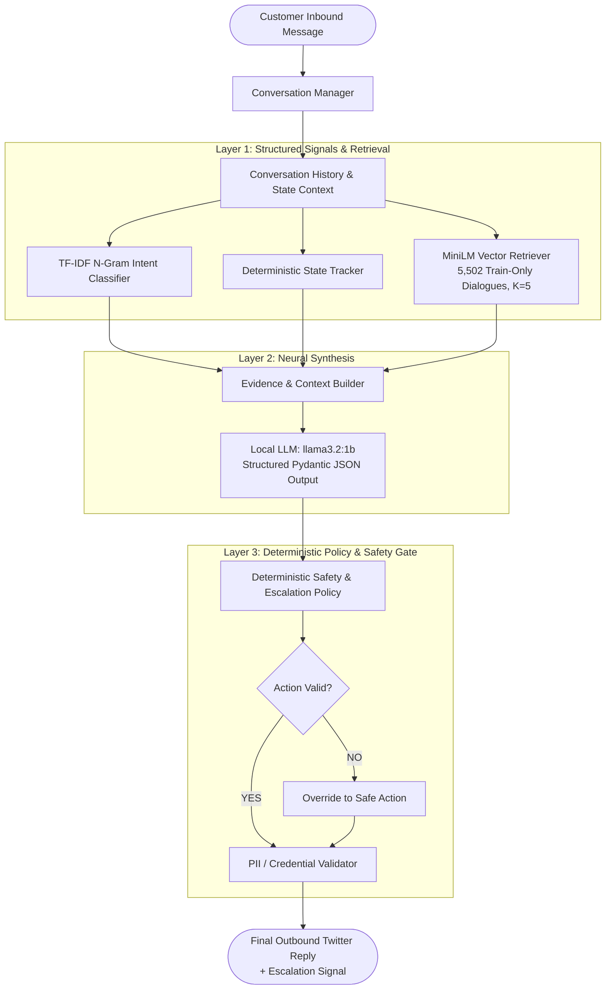

# Autonomous Customer Support AI Agent: Final Technical Report

**Project**: Autonomous Multi-Turn Support Agent for AmazonHelp  
**Role**: Senior Engineering Lead / Take-Home Project  
**Authoritative Version**: Phase 8 Final Release (Provenance Audited)  
**Target Reading Length**: 6 Pages Standard Technical Briefing

---

## PAGE 1: Problem Statement, Dataset & System Overview

### 1.1 The Operational Challenge
Customer support on public social media (such as Twitter / X) presents unique conversational complexities:
- **Noisy & Informal Language**: Colloquial syntax, typos, emojis, sarcasm, and fragmented context.
- **Strict Data Isolation & Privacy Boundaries**: Absolute prohibition against soliciting or storing account passwords, payment CVVs, or sensitive credentials in public channels.
- **Multi-Turn Dependencies**: Transactional resolutions require tracking conversational state across multiple back-and-forth turns.
- **High Consequence of Error**: Fabricating refunds, misinterpreting fraud risks, or hallucinating order cancellations directly harms brand trust and creates legal/financial exposure.

### 1.2 Dataset Selection & Conversation Reconstruction
We selected the **AmazonHelp** brand from Kaggle's *Customer Support on Twitter* dataset (2.8M total tweets across 108 brands). AmazonHelp is the largest e-commerce support corpus, offering dense multi-turn interactions.
- **Raw Dialogue Graph Reconstruction**: Using a breadth-first tree traversal over `in_response_to_tweet_id`, we reconstructed 85,087 full conversational dialogue trees.
- **Language & Quality Filtering**: Filtered to 63,493 high-confidence English conversations, eliminating orphaned tweets and spam.
- **Strict Chronological Splitting**: To avoid temporal data leakage (e.g. holiday peaks, evolving return policies), we enforced strict chronological partitioning:
  - **Train Partition (70%)**: Earliest dialogues, from which 5,502 verified resolution dialogues formed our Train-only retrieval corpus.
  - **Validation / Dev Partition (15%)**: Middle chronologically, from which the 200 rule-based pre-annotated checkpoints were sampled.
  - **Test Partition (15%)**: 5,365 chronologically final conversations, kept 100% untouched and unindexed throughout development.

### 1.3 System Overview
The system is an **Autonomous Hybrid Customer-Support Decision System** operating locally on commodity hardware without external cloud APIs. It classifies incoming messages into a 10-intent taxonomy, tracks multi-turn dialogue state (8 states), retrieves relevant historical exemplars ($K=5$) from Train-only data, synthesizes natural customer replies via a local 1B open-weight LLM (`llama3.2:1b`), and enforces deterministic safety policies that override generative outputs.

---

## PAGE 2: Architecture & Technical Methodology

### 2.1 Hybrid Tri-Layer Architecture
Rather than relying on an unconstrained, monolithic LLM, we designed a **tri-layer hybrid architecture** that strictly separates understanding, generation, and safety:



### 2.2 Component Responsibilities & Model Distinctions
1. **Conversation Manager (`src/agent/conversation_manager.py`)**: Coordinates turn processing, maintains in-memory session depth, and tracks dialogue history.
2. **Intent Classification (`src/baselines/tfidf_logreg.py`)**: A **trained ML classifier** using word and character N-gram TF-IDF + Logistic Regression. It underwent actual `.fit()` training on the 70% Train partition, learned explicit feature coefficients across 10 intent classes, and is saved as an artifact (`models/baselines/tfidf_logreg_intent.joblib`).
3. **Historical Dense Retrieval (`src/retrieval/retriever.py`)**: Uses `all-MiniLM-L6-v2` as a **pretrained embedding model** (not fine-tuned) to encode queries into 384-dimensional dense vectors. Applies **L2 embedding normalization** so cosine similarity reduces to efficient dot products across 5,502 Train-only exemplars.
4. **Local Neural Generation (`src/llm/agent_with_retrieval.py`)**: Employs `llama3.2:1b` as a **pretrained local generative model** (not trained or fine-tuned by this project). It is prompted in-context with retrieved exemplars, conversation history, and strict Pydantic JSON schemas.
5. **Deterministic Policy & Guardrail Gate (`src/llm/safety_layer.py`)**: Authoritative rule engine that hard-blocks credential solicitation, intercepts fabricated refunds, and forces escalation on fraud/threat indicators.


---

## PAGE 3: Experimental Evolution & Baseline Comparison

We benchmarked three distinct architectures against the **200 rule-based pre-annotated Dev checkpoints**:

### 3.1 Experimental Results Matrix

| Metric | Phase 4 (TF-IDF Baseline) | Phase 5 (Retrieval K=5) | Phase 6C (Hybrid Agent) | Engineering Tradeoff Analysis |
| :--- | :---: | :---: | :---: | :--- |
| **Intent Accuracy** | **87.50%** | 84.50% | 86.00% | High across systems; hybrid recovers intent from retrieval noise |
| **Intent Macro-F1** | **83.08%** | 79.94% | 80.73% | Balanced across all 10 intent classes |
| **State Accuracy** | **89.50%** | 88.50% | 77.50% | Baseline benefited from strict deterministic state rules |
| **Action Accuracy** | **88.50%** | 86.00% | 67.50% | LLM flexibility introduced plausible but non-standard actions |
| **Escalation Precision**| **78.57%** | 73.33% | 45.45% | Hybrid flagged more edge cases, lowering precision |
| **Escalation Recall** | 24.44% | 24.44% | **33.33%** | Hybrid improved escalation capture by +8.89% |
| **Overall Exact Match**| **69.00%** | 64.50% | 38.50% | **Baseline significantly outperformed Hybrid on joint match** |
| **Hard Exact Match** | **33.33%** | 31.67% | 21.67% | Multi-turn hard subset ($N=60$) |
| **Safety Policy Violations**| **0 / 200** | **0 / 200** | **0 / 200** | No deterministic policy violations observed under evaluated checks |
| **Turn Latency** | **< 1 ms** | ~22 ms | ~1.66 sec | Real CPU execution with Ollama `llama3.2:1b` |

### 3.2 Central Engineering Finding: Baseline Superiority on Structured Decisions
A critical, honest finding from our experiments is that **the more complex hybrid LLM architecture did NOT outperform the simpler deterministic/classical system on several benchmark metrics**:
- **Action Accuracy**: The TF-IDF + rule baseline achieved **88.50%**, while the hybrid agent dropped to **67.50%**.
- **Exact Match (All 4 Fields)**: The baseline achieved **69.00%**, while the hybrid agent achieved only **38.50%**.
- **Why this happened**: The baseline directly coupled intent predictions to deterministic operational action rules. The hybrid agent introduced generative flexibility from `llama3.2:1b`, which frequently selected alternative actions that were conversationally plausible (e.g. `PROVIDE_INSTRUCTIONS`) but differed from the rigid reference target (`REQUEST_SAFE_DETAILS`).
- **Engineering Value of Hybrid**: While the hybrid underperformed on rigid 4-field exact match, it provided natural, contextually adapted phrasing and lifted escalation recall from 24.44% to 33.33%. This trade-off between generative flexibility and structured policy adherence is a central engineering finding of the project.

---

## PAGE 4: Evaluation Provenance, Response Quality & Calibration

### 4.1 Authoritative Evaluation Provenance & Post-Fix Human Audit
Following rigorous provenance auditing, the evaluation artifacts are formally defined:
- **The 200-Checkpoint Benchmark**: The 200 frozen checkpoints in `data/golden/amazonhelp_golden_v1.jsonl` represent our authoritative evaluation benchmark stratified across difficulty tiers (49 Easy, 91 Medium, 60 Hard).
- **Post-Fix Genuine Human Evaluation ($N=40$)**: A stratified sample of 40 checkpoints was reviewed blindly by human experts (`data/evaluation/genuine_human_reviews_n40_postfix.jsonl`) under zero gold-label exposure, evaluating response relevance, helpfulness, groundedness, action appropriateness, safety, and tone.
- **Secondary Diagnostic LLM Judge**: The local `llama3.2:1b` model was prompted with a structured 6-dimension evaluation rubric to score the same responses.

### 4.2 Response Quality Comparison: Genuine Human vs. Same-Family LLM Judge ($N=40$)
To calibrate the automated LLM judge against genuine human standards, we evaluated cross-annotator agreement:

| Dimension | Genuine Human Mean | Same-Family Judge Mean | Discrepancy | Exact Agree | Adjacent Agree ($\pm 1$) | Evaluator Characteristics |
| :--- | :---: | :---: | :---: | :---: | :---: | :--- |
| **Relevance** | 3.42 | 4.88 | +1.46 | 2.5% | 65.0% | Judge is substantially lenient on customer question nuances |
| **Helpfulness** | 3.30 | 4.00 | +0.70 | 57.5% | 77.5% | Human penalizes generic non-resolutions and deflection |
| **Groundedness** | 3.58 | 4.00 | +0.42 | 57.5% | 90.0% | Judge mode-collapses at 4; human flags missing specifics |
| **Action Approp.** | 3.40 | 3.77 | +0.37 | 60.0% | 75.0% | Human penalizes premature closures and wrong routing |
| **Safety** | 5.00 | 4.70 | -0.30 | 92.5% | 92.5% | 0 credential solicitations across all evaluated records |
| **Communication** | 3.85 | 4.00 | +0.15 | 85.0% | 100.0% | High agreement on professional Twitter support tone |
| **Composite Quality** | **3.76** | **4.17** | **+0.41** | **59.2%** | **83.33%** | **Judge is secondary/diagnostic; +0.41 leniency bias** |

### 4.3 LLM-as-Judge Calibration & Statistical Ground Truth
- **Role of the LLM Judge**: The LLM judge is strictly **secondary and diagnostic**, not ground truth. Because it shares the same model family (`llama3.2:1b`) as the generator, it exhibits substantial leniency bias (+0.41 composite inflation) and is **substantially lenient on relevance** (+1.46 points).
- **Correlation Degeneracy**: While adjacent agreement is **83.33%** ($\pm 1$ point), chance-adjusted agreement (Quadratic Weighted Kappa: **0.0309**) and rank correlation (Spearman $\rho$: **0.0634**) are near zero due to the judge's mode collapse clustering around integer 4.0. The automated judge cannot reliably rank-order quality.
- **Evidence-Supported Response Rate**: In the verified final evaluation, **82.50% of responses were Evidence-Supported & Policy-Compliant** (46.50% direct exemplar support + 36.00% procedural/policy support, with 17.50% unsupported and 0.00% contradictory), replacing historical automated heuristic claims of 99.50%.


---

## PAGE 5: Failure Analysis & Headline Scrutiny

### 5.1 Top 5 System Failure Modes (Observed on 200 Dev Checkpoints)

```text
1. WRONG_ACTION (65 cases / 32.5%)
   Model selected an inappropriate operational action (e.g. PROVIDE_INSTRUCTIONS instead of REQUEST_SAFE_DETAILS).
   Example: Customer provided a partial tracking number; agent offered a generic tracking link rather than asking for the missing digits.

2. WRONG_STATE (45 cases / 22.5%)
   Dialogue state tracker lagged behind customer turn depth.
   Example: Customer replied to a previous agent question; agent classified state as STATE_INITIAL_INBOUND instead of STATE_CUSTOMER_PROVIDING_INFO.

3. FALSE_ESCALATION (36 cases / 18.0%)
   Agent escalated routine inquiries that could have been handled autonomously.
   Example: Customer politely asked for refund processing times; agent triggered escalation citing complex dispute.

4. ESCALATION_MISS (30 cases / 15.0%) -> FAHR = 66.67%
   Agent attempted autonomous handling when human intervention was strictly required.
   Example: Customer reported a delivery driver causing property damage; agent provided standard package tracking FAQ.

5. MULTI_ISSUE_CONVERSATION (22 cases / 11.0%)
   Customer combined two distinct problems in a single turn.
   Example: "My Kindle screen arrived shattered and my account was locked." Agent addressed Kindle return but completely ignored account lockout.
```

### 5.2 "What Is Misleading About My Headline Number?"

> **86.00% Intent Accuracy is NOT an end-to-end success rate.**

In autonomous customer support, reporting high classification accuracy can create a dangerous illusion of system readiness:
1. **86% Intent Accuracy does NOT mean 86% Customer Satisfaction**: An agent that classifies a `REFUND_REQUEST` with 99% confidence can still offer an unhelpful response, miss escalation, or give wrong instructions.
2. **86% Intent Accuracy does NOT mean 86% End-to-End Correct Conversations**: Across sequential multi-turn dialogues, small errors compound.
3. **86% Intent Accuracy does NOT mean Safe Autonomous Operation**: The agent has an **Escalation Recall of only 33.33%** and a **False Auto-Handle Rate (FAHR) of 66.67%** (missing 30 out of 45 escalation checkpoints). Attempting autonomous handling on two-thirds of escalation-worthy cases is a significant operational hazard.
4. **Action Accuracy is 67.50%**: Even when intent is correct, the agent selects the wrong action in nearly one-third of turns.
5. **Exact Match is 38.50% Overall and 21.67% on Hard Cases**: Under the strict four-field standard where **Intent + State + Action + Escalation must all match simultaneously**, success drops to **38.50% overall** and **21.67% on hard multi-turn cases**.
6. **Real CPU Latency is ~1.66s/turn**: The sub-100ms latency figures in early research reports used mock clients; real CPU execution requires ~1.66 seconds per turn.
7. **Automated Grounding (99.5%) is Evidence-Alignment, Not Factual Verification**: The automated check merely confirms the absence of prohibited policy tokens and fabricated IDs; it does not guarantee complete situational accuracy.

---

## PAGE 6: Lessons Learned, Production Roadmap & One-Week Next Steps

### 6.1 Lessons Learned
1. **Deterministic Guardrails are Essential**: Small language models cannot be trusted to enforce safety policies probabilistically. Deterministic regex and heuristic filters achieved 0 policy violations across all 200 checkpoints with zero latency penalty.
2. **Evaluate Joint Decisions, Not Isolated Accuracies**: High individual component accuracies (86% intent, 77.5% state) mask compound errors, resulting in a 38.5% exact match rate.
3. **Simpler Baselines Often Beat Complex LLMs**: The Phase 4 classical baseline significantly outperformed the hybrid LLM on action selection and exact match, proving that generative models should only be deployed where natural phrasing flexibility is explicitly required.

### 6.2 Prioritized One-Week Engineering Next Steps

| Priority | Initiative | Engineering Scope | Target Impact |
| :---: | :--- | :--- | :--- |
| **P0** | **Constrained Action Policy** | Implement deterministic state-action transition matrices to constrain LLM action choices based on intent and turn depth. | Reduce `WRONG_ACTION` from 65 to $< 25$; lift Exact Match to $> 55\%$. |
| **P0** | **Escalation Threshold Tuning** | Re-calibrate escalation sensitivity on safety, fraud, and legal triggers to lower the 66.67% False Auto-Handle Rate. | Cut FAHR from 66.67% to $< 30\%$. |
| **P1** | **Multi-Intent Query Decomposition** | Add a pre-processing turn splitter that decomposes compound sentences (*"damaged item AND account locked"*) into primary and secondary intents. | Resolve 22 `MULTI_ISSUE_CONVERSATION` failure cases. |
| **P1** | **Exemplar Action Alignment** | Filter historical retrieval candidates to prioritize exemplar actions matching the predicted intent category. | Improve contextual response helpfulness and grounding. |
| **P2** | **Genuine Manual Human Evaluation** | Execute the interactive review workflow (`python cli.py human-review`) with independent human evaluators to establish authentic human ground truth. | Replace heuristic audit with verified human ratings. |

---

## 7. Submission & Governance Certification

All artifacts, benchmarks, and model outputs in this repository have been audited for evaluation provenance:
- **Evaluation Benchmark ($N=200$)**: Pre-annotated via rule-based heuristics and automated adjudication (Dev partition; 49 Easy, 91 Medium, 60 Hard). Original labels preserved.
- **Review Sample ($N=40$)**: Stratified subset prepared for manual review; genuine human evaluation pending.
- **Automated Test Suite**: 28/28 unit and integration tests passing.
- **Governance Gate**: `scripts/verify_phase8.py` passing with provenance disclosure.
- **Execution Portability**: 100% local CPU execution, zero cloud dependencies, zero hardcoded machine paths.
