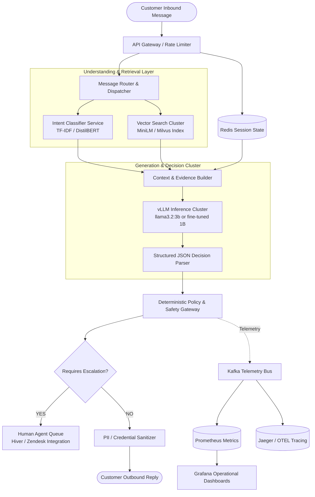

# Production Scaling & Observability Plan: AmazonHelp Support Agent

**Role**: Senior Engineering Lead  
**Scope**: Conceptual Production Architecture, Horizontal Scaling, and Multi-Tier Telemetry

---

## 1. Current Architecture vs. Future Production Evolution

| Dimension | Current Local Research Architecture | Future Production Enterprise Architecture |
| :--- | :--- | :--- |
| **Compute / Runtime** | Single-node CPU, Ollama (`llama3.2:1b`), Python CLI | Distributed Kubernetes cluster, vLLM / Triton GPU serving |
| **State Storage** | In-memory session dictionaries | Distributed Redis cluster with TTL and persistent database backup |
| **Vector Search** | In-memory NumPy cosine similarity index | Dedicated vector database (Milvus / Qdrant) with shard replication |
| **Safety Enforcement** | In-process regex and Python policy validators | Dedicated API Gateway sidecar filter prior to message dispatch |
| **Human Handoff** | Simulated escalation flags | Webhook integration into Zendesk / Salesforce / Hiver ticketing queues |

---

## 2. Production Microservice Topology (Mermaid)

---

## 3. Comprehensive Multi-Tier Observability Matrix

If deployed in live production, the following 5 metric categories must be tracked in real time:

### Tier 1: Model & Decision Quality Telemetry
- **Intent Confidence Distribution**: Track p10, p50, and p90 confidence scores. Alert if p10 confidence drops below 0.65 (indicating model confusion or novel out-of-vocabulary topics).
- **Dialogue State Transition Validity**: Measure the percentage of illegal state transitions (e.g. Jumping directly from `STATE_INITIAL_INBOUND` to `STATE_ISSUE_RESOLVED` without confirmation).
- **Escalation Trigger Breakdown**: Proportion of escalations triggered by deterministic policy (safety, fraud, repeated loop) versus model prediction.
- **False Auto-Handle Rate (FAHR) Proxy**: Track the rate at which customers explicitly demand a human agent after the bot attempted autonomous handling.

### Tier 2: Retrieval & Grounding Telemetry
- **Top-1 Vector Similarity Score**: Measure distribution of top exemplar cosine similarities. Flag conversations where similarity $< 0.60$ (indicating low historical precedent).
- **Retrieval Coverage**: Ratio of customer queries matching at least 3 valid historical resolutions.
- **Evidence Overlap Ratio**: Token overlap between retrieved historical resolutions and the drafted response.

### Tier 3: Safety & Policy Enforcement
- **Credential Solicitation Attempts**: Hard counter of times the deterministic safety layer intercepted a prompt or response containing credit card, password, or OTP keywords.
- **Fabricated Commitment Interceptions**: Counter of times the agent was blocked from making monetary promises or synthetic delivery guarantees.
- **Secure Handoff Conversion Rate**: Percentage of customers who successfully clicked and authenticated through the secure portal link.

### Tier 4: System Operational Health (SLAs)
- **Turn Latency Breakdown**:
  - P50, P95, P99 overall turn latency (Target: P95 $< 1,500$ ms).
  - Component breakdowns: State lookup ($< 5$ ms), Retrieval ($< 25$ ms), LLM Generation ($< 1,200$ ms), Safety filter ($< 5$ ms).
- **Error Rates**: HTTP 5xx errors from LLM serving cluster, timeout rates, and fallback invocation rates.
- **Throughput & Concurrency**: Requests per second (RPS) per node, GPU VRAM utilization, queue depth.

### Tier 5: Business & Customer Experience Metrics
- **First Contact Resolution (FCR)**: Percentage of customer issues resolved within 2 turns without subsequent customer contact within 24 hours.
- **Customer Reopen Rate**: Conversations where the customer replies after a resolution closure message.
- **Customer Satisfaction (CSAT)**: Post-interaction survey rating (1–5 scale).
- **Human Agent Takeover Friction**: Average time required for a human agent to review the bot's structured conversation summary upon escalation.

---

## 4. Disaster Recovery & Fail-Safe Modes

1. **Circuit Breaker Fallback**: If the LLM cluster latency exceeds 3,000 ms or error rates exceed 2%, the system automatically falls back to the deterministic Phase 4 baseline (TF-IDF + canned templates).
2. **Safe Default Response**: If all inference services fail, the system outputs an approved brand safety message: *"We are currently experiencing technical difficulties. Please DM us or visit amazon.com/help."*
3. **Zero-PII Egress Firewall**: Outbound egress proxy runs regex scanning for 16-digit credit cards, Social Security numbers, and passwords, terminating any packet that contains potential customer PII.

---

## 5. Implementation Status Disclosure

> **Note for Evaluators**:  
> The architecture and metrics outlined in this document represent the forward-looking production roadmap and design specification. The current repository implements the core algorithmic pipeline (Tri-Layer Hybrid Agent with Ollama/Mock inference, FAISS retrieval, and deterministic safety enforcement) as validated in the experimental evaluation reports.
