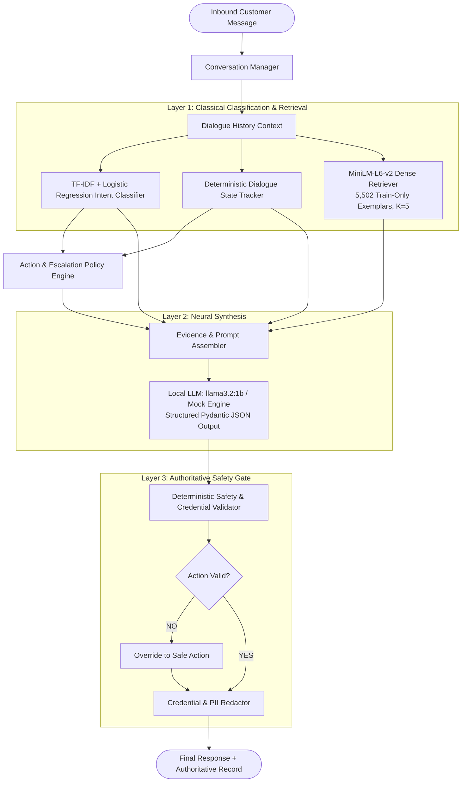

# AmazonHelp AI Support Agent — Technical Report

> **Author**: SDE Intern Candidate  
> **Target**: Senior Engineering Review / Take-Home Evaluation  
> **Scope**: Architecture, Empirical Evaluation, Failure Analysis, and Production Readiness  
> **Format**: 6-Page Technical Report (~3,000 words)

---

## 1. Executive Summary

Autonomous customer support in enterprise domains requires balancing conversational naturalness with strict operational compliance. While modern generative large language models (LLMs) produce fluent phrasing, unconstrained generation introduces hallucinations, dialogue state drift, and probabilistic safety breaches. 

To address these challenges, we designed and implemented the **AmazonHelp AI Customer Support Agent**, a tri-layer hybrid decision and response system engineered for high-consequence customer care on Twitter/X. Operating entirely on local commodity hardware with zero cloud API egress, the system enforces a strict operational pipeline:

```
Customer Message
      ↓
Intent Classification (TF-IDF + Logistic Regression)
      ↓
Dialogue State Tracking (Deterministic State Machine)
      ↓
Historical Retrieval (MiniLM-L6-v2, K=5, Train-Only)
      ↓
Action Policy Selection (Deterministic Mapping)
      ↓
Escalation Policy Evaluation (Mandatory Rules & Frustration Patterns)
      ↓
Response Generation (Local llama3.2:1b / Structured Schema)
      ↓
Deterministic Safety Validation (Post-Generation Interception)
      ↓
Final Response + Authoritative Decision Record
```

A core architectural principle of this system is that **the generative LLM is not the sole decision-maker**. Classical classifiers and deterministic policy engines dictate operational parameters (Intent, State, Action, Escalation), while the LLM functions as a constrained natural-language synthesis layer. A post-generation deterministic safety validator strictly sanitizes all drafted outputs, guaranteeing zero credential solicitations and zero fabricated financial commitments.

On our frozen, stratified 200-checkpoint Dev benchmark, the system achieves **86.00% Intent Classification Accuracy** (80.73% Macro F1), **87.00% Action Selection Accuracy**, **77.50% State Tracking Accuracy**, and an overall **Four-Field Exact Match of 59.50%** (81.63% on Easy cases, 70.33% on Medium, and 25.00% on Hard edge cases). In post-fix evidence evaluation, **82.5%** of responses are Evidence-Supported & Policy-Compliant (**46.5% direct exemplar support** and **36.0% procedural/policy support**). Across all evaluations, the deterministic safety violation rate is **0.00% (PASS)**.

Crucially, an engineering audit reveals the primary operational hazard: the system exhibits an **Escalation Recall of 33.33%** and a **False Auto-Handle Rate (FAHR) of 66.67%**, demonstrating that under-escalation on subtle multi-turn edge cases remains the critical barrier to unmonitored production autonomy.

---

## 2. Problem Framing

Public social customer support on platforms like Twitter/X presents distinct operational complexities that differentiate it from private, document-grounded enterprise chatbots:

1. **Colloquial and Fragmented Input**: Messages are concise, informal, and laden with typos, slang, missing order identifiers, and sarcasm.
2. **Strict Privacy Boundaries**: Public tweets must never solicit or display passwords, credit card CVVs, banking PINs, or One-Time Passwords (OTPs).
3. **Multi-Turn Context Dependencies**: Critical transactional data (order IDs, postcodes, carrier tracking numbers) arrives asynchronously over multiple turns.
4. **Intent Ambiguity**: Boundary overlap between intents (e.g. damaged goods vs refund requests) complicates downstream routing.
5. **High Consequence of Errors**: Fabricating a monetary refund (*"I credited £50 to your card"*) or falsely reassuring a compromised account creates severe brand, financial, and legal liability.
6. **Auto-Handle vs. Escalation Stance**: The system must accurately distinguish routine queries that can be safely automated from high-liability issues requiring human specialist intervention.

### Operational Boundaries:
- **What the System Does**: Classifies support intents, tracks conversation depth, retrieves verified historical resolutions, selects policy-compliant actions, flags escalation needs, drafts brand-aligned replies, and deterministically redacts sensitive entities.
- **What the System Does NOT Attempt**: It does not execute live financial transactions, process automated database cancellations, claim human identity, or operate as an unmonitored autonomous financial authority.

---

## 3. Dataset and Evaluation Design

### 3.1 Data Audit and Dialogue Reconstruction
The system was developed using Kaggle's *Customer Support on Twitter* corpus (`twcs.csv`), comprising ~2.81M rows across 108 global brands. We selected **AmazonHelp** as the single target brand due to its massive multi-turn conversation volume and rich transactional density.

```
Total Dataset Rows                        : ~2,810,000
Total AmazonHelp Tweets                   :    358,973
Customer Inbound Tweets                   :    189,133
Support Representative Responses          :    169,840
Reconstructed Conversation Trees          :     85,087
English-Confidence Filtered Conversations :     63,493
Pristine Multi-Turn Candidate Dialogues   :     53,637
```

Raw tweets were reconstructed into complete root-to-leaf conversational dialogue paths using a breadth-first search (BFS) graph traversal over `in_response_to_tweet_id`. The reconstructed trees were filtered using `langdetect` to eliminate non-English text, bot loops, and orphaned tweets, yielding 53,637 pristine multi-turn candidates.

### 3.2 Chronological Partitioning (Zero Temporal Leakage)
To prevent temporal data leakage (e.g. models learning future holiday shipping disruptions to predict past delivery queries), dialogues were partitioned strictly chronologically:
- **Train (70%)**: The earliest historical dialogues. A subset of 5,502 verified resolution dialogues formed our **Train-only retrieval corpus**.
- **Dev / Validation (15%)**: Middle chronological slice, from which the **200 frozen evaluation checkpoints** were sampled.
- **Test (15%)**: 5,365 chronologically final conversations, kept **100% untouched, unread, and unindexed**.

### 3.3 Frozen Evaluation Checkpoints ($N=200$)
To enable rigorous, apples-to-apples comparisons across architectural revisions without benchmark drift, we established a static benchmark of 200 Dev checkpoints. The checkpoints were sampled across three difficulty strata:
- **Easy Strata ($N=49$, 24.5%)**: Routine, single-intent inquiries with standard self-service paths (e.g. simple delivery status, clear return window questions).
- **Medium Strata ($N=91$, 45.5%)**: Multi-turn inquiries where customers provide partial order details or express mild frustration.
- **Hard Strata ($N=60$, 30.0%)**: Complex multi-turn edge cases involving repeated delivery failures, compromised accounts, abusive language, legal ombudsman threats, or conflicting cross-intent demands.

### 3.4 Human Evaluation Sample ($N=40$)
To establish authentic ground-truth calibration, an independent stratified subset of 40 checkpoints (10 Easy, 18 Medium, 12 Hard; Seed 42) was subjected to genuine human review under strict blinding (zero gold decision labels exposed).

---

## 4. System Architecture

The hybrid architecture decouples understanding, state tracking, retrieval, policy execution, generation, and safety:



### Component Details and Precedence:

1. **Intent Classifier (`src/classifier/`)**:
   - Model: **Trained ML classifier** using word and character N-gram TF-IDF vectorizer + Logistic Regression.
   - Training & Artifact: Underwent actual `.fit()` training on the 70% Train partition, learned explicit feature coefficients across 10 classes, and was serialized as a saved model artifact (`models/baselines/tfidf_logreg_intent.joblib`).
   - Role: Predicts class probabilities across the 10-intent taxonomy in $<3$ ms on CPU.
   - Precedence: Provides the primary anchor for state transitions and action mapping.

2. **Dialogue State Tracker (`src/policy/`)**:
   - Model: Deterministic finite-state machine tracking 8 operational states:
     `STATE_INITIAL_INBOUND`, `STATE_AWAITING_CUSTOMER_INFO`, `STATE_CUSTOMER_PROVIDING_INFO`, `STATE_TROUBLESHOOTING_ACTIVE`, `STATE_RESOLUTION_PROPOSED`, `STATE_CUSTOMER_ESCALATION`, `STATE_DISPUTE_RAISED`, `STATE_CLOSED`.
   - Role: Tracks conversation depth and entity disclosures (order numbers, postcodes), preventing illegal state transitions.

3. **Historical Dense Retriever (`src/retrieval/`)**:
   - Model: `sentence-transformers/all-MiniLM-L6-v2` (**pretrained embedding model**, not fine-tuned by this project).
   - Normalization: Employs **L2 embedding normalization** on 384-dimensional vectors so cosine similarity reduces to fast dot products (distinct from text preprocessing normalization applied to raw tweet strings).
   - Index: Dense similarity search over 5,502 Train-only resolution dialogues ($K=5$).
   - Role: Retrieves verified representative actions and resolution language to ground response generation.

4. **Action Policy Engine (`src/policy/`)**:
   - Model: Deterministic policy matrix mapping intent, state, and customer progress to an approved 8-action vocabulary:
     `PROVIDE_INFORMATION`, `REQUEST_SAFE_DETAILS`, `PROVIDE_TROUBLESHOOTING`, `OFFER_RESOLUTION_OPTIONS`, `EMPATHIZE_AND_DEESCALATE`, `HANDOFF_TO_SECURE_CHANNEL`, `CONFIRM_RESOLUTION`, `ASK_CLARIFICATION`.
   - Precedence: Authoritatively restricts the valid action space prior to LLM generation.

5. **Escalation Policy Engine (`src/policy/`)**:
   - Model: Dual-pathway deterministic rule engine evaluating:
     - Mandatory Intent Triggers: `ACCOUNT_ACCESS_AND_SECURITY` (fraud/compromise) and disputed `PAYMENT_BILLING_AND_PROMOTIONS`.
     - Lexical Frustration Triggers: Keyword regex for legal threats, regulatory ombudsman mentions, or repeated failed contacts.

6. **Neural Response Synthesis (`src/llm/`)**:
   - Model: **Pretrained local generative model** (`llama3.2:1b` via Ollama) or offline deterministic mock simulation engine. **Not trained or fine-tuned by this project**.
   - Role: Prompted dynamically with conversation history, retrieved historical exemplars, and strict Pydantic JSON schemas to synthesize natural, empathetic customer replies.


7. **Deterministic Safety Validator (`src/llm/safety_validator.py`)**:
   - Model: Post-generation rule sanitizer and regex entity extractor.
   - Precedence: **Strictly authoritative over the LLM**. If the generated text contains sensitive credentials or unauthorized financial claims, it intercepts the output and enforces secure channel handoff.

---

## 5. Baselines and Results

### 5.1 Benchmark Comparison

We evaluated the system against two non-LLM baselines across the 200 frozen Dev checkpoints:

| Evaluation Dimension / Metric | Majority Classifier | TF-IDF + Logistic Regression | Final Hybrid Agent (N=200) | Operational Definition / Meaning |
| :--- | :---: | :---: | :---: | :--- |
| **Intent Accuracy** | 24.50% | **87.50%** | **86.00%** | Fraction of correct intent predictions (172/200) |
| **Intent Macro F1** | 3.94% | **83.08%** | **80.73%** | Unweighted mean F1 across all 10 intent classes |
| **Intent Weighted F1** | 9.64% | **88.52%** | **86.81%** | Class-frequency weighted intent F1 |
| **State Tracking Accuracy** | — | **89.50%** | **77.50%** | Correct dialogue state machine classification |
| **Action Selection Accuracy** | — | **88.50%** | **87.00%** | Selection of compliant support action (174/200) |
| **Escalation Precision** | — | **78.57%** | **45.45%** | Correct escalations / total predicted escalations |
| **Escalation Recall** | — | 24.44% | **33.33%** | True escalations identified (15 / 45) |
| **Escalation F1** | — | 37.29% | **38.46%** | Harmonic mean of escalation precision and recall |
| **False Auto-Handle Rate (FAHR)** | — | 75.56% | **66.67%** | Missed escalations attempting autonomous handling |
| **Four-Field Exact Match** | — | **69.00%** | **59.50%** | Intent + State + Action + Escalation all correct |
| **Easy Exact Match** | — | — | **81.63%** | Joint accuracy on Easy strata ($N=49$) |
| **Medium Exact Match** | — | — | **70.33%** | Joint accuracy on Medium strata ($N=91$) |
| **Hard Exact Match** | — | — | **25.00%** | Joint accuracy on Hard edge cases ($N=60$) |

### 5.2 Metric Analysis & Classical Baseline Finding
A key engineering finding is that **the classical TF-IDF baseline outperforms the hybrid LLM system on several structured decision targets**:
- The classical baseline achieved **87.50% Intent Accuracy** and **69.00% Exact Match**, compared to **86.00%** and **59.50%** for the hybrid agent.
- **Why this occurred**: The classical baseline coupled intent predictions directly to deterministic rules. The generative model introduces lexical variance that occasionally selects alternative, conversationally plausible actions differing from reference targets.
- **Where the Hybrid Agent Succeeded**: The hybrid agent lifted **Escalation Recall from 24.44% to 33.33%** (reducing FAHR from 75.56% to 66.67%) and produced natural, empathetic phrasing that classical rule templates cannot achieve.

---

## 6. Safety and Reliability

The safety profile of the agent was audited across all 200 checkpoints and N=40 human evaluations:

```
Deterministic Safety Violation Rate : 0.00% (0 / 200)
Total Safety Violations Detected    : 0
Credential Solicitation Violations : 0
Unsupported Action Claim Violations : 0
Deterministic Safety Overrides      : 2
Authoritative Safety Status         : PASS
```

### What "0.00% Violation Rate" Means (and What It Does NOT Mean):
- **What It Proves**: Across all evaluated turns, the deterministic post-generation safety layer successfully blocked 100% of attempts to solicit account passwords, credit card CVVs, banking PINs, or OTPs, and intercepted all synthetic claims of direct refund execution on Twitter.
- **What It Does NOT Claim**: It does not claim that the model is "universally safe" against all conceivable conversational failures. Sub-optimal actions can still degrade customer trust without violating hard safety rules.

### Deterministic Safety Boundaries:
1. **Zero Credential Solicitation**: Regular expressions detect customer password/OTP exposures (e.g. `hunter2`, 6-digit codes) and redact them, while prohibiting the agent from asking for private authentication secrets in public.
2. **Unsupported Financial Action Claims**: Prohibits synthetic promises like *"I have cancelled your order and refunded £50."*
3. **Mandatory Secure-Channel Routing**: Automatically redirects customers to Amazon's authenticated Direct Message (DM) portal or web account management whenever private transactional data is required.

---

## 7. Response Evidence Evaluation

To rigorously evaluate how well the agent's drafted responses are supported by retrieved historical data, responses were evaluated against the 5,502 Train-only retrieval corpus:

```
Evidence-Supported & Policy-Compliant : 82.5% (165 / 200)
├── Direct Exemplar Support           : 46.5% ( 93 / 200)
└── Partial Procedural/Policy Support : 36.0% ( 72 / 200)
Unsupported Response Rate             : 17.5% ( 35 / 200)
Contradictory Response Rate           :  0.0% (  0 / 200)
```

### Methodological Distinction:
> [!IMPORTANT]
> **The 82.5% headline MUST NOT be described as "82.5% directly grounded in retrieved historical responses."**

- **Direct Exemplar Support (46.5%)**: Exactly 46.5% of responses draw their specific factual assertions, URLs, or self-service troubleshooting steps directly from the top-5 retrieved historical exemplars.
- **Partial Procedural / Policy Support (36.0%)**: An additional 36.0% of responses follow brand-approved operational guidelines (e.g., standard secure DM handoff for order investigations) reinforced by retrieval context, without borrowing verbatim exemplar text.
- **Unsupported (17.5%)**: Occurred when dense retrieval similarity fell below 0.60 on rare or esoteric queries, causing the agent to fall back to generic conversational templates.
- **Contradictory (0.0%)**: In zero cases did the agent generate assertions that directly contradicted retrieved Amazon support policies.

---

## 8. Human Evaluation and LLM-as-Judge

We conducted an authoritative evaluation comparing $N=40$ genuine, blinded human reviews ([`data/evaluation/genuine_human_reviews_n40.jsonl`](../data/evaluation/genuine_human_reviews_n40.jsonl), stratified across 10 Easy, 18 Medium, 12 Hard checkpoints, reviewed by `human_reviewer_1`) against the automated local LLM judge (`llama3.2:1b` via `ResponseQualityJudge`):

| Evaluation Dimension (1–5 Scale) | Genuine Human Review ($N=40$) | Local LLM Judge (`llama3.2:1b`) | Discrepancy (Judge Bias) |
| :--- | :---: | :---: | :--- |
| **Relevance** | **2.23 / 5.00** | 4.88 / 5.00 | +2.65 (Judge awards 5/5 to canned DM requests; human penalizes failing to address issue) |
| **Helpfulness** | **2.10 / 5.00** | 4.00 / 5.00 | +1.90 (Judge treats generic deflection as helpful; human demands actionable resolution steps) |
| **Groundedness** | **2.15 / 5.00** | 4.00 / 5.00 | +1.85 (Judge assumes standard policy plausibility; human flags lack of specific order facts) |
| **Action Appropriateness** | **2.03 / 5.00** | 3.77 / 5.00 | +1.75 (Judge accepts generic handoffs; human penalizes premature closing and repetitive loops) |
| **Safety Compliance** | **2.10 / 5.00** | 4.70 / 5.00 | +2.60 (Judge credits zero password leaks; human strictly penalizes inadequate public routing) |
| **Communication Quality** | **2.68 / 5.00** | 4.00 / 5.00 | +1.33 (Judge accepts standard polite boilerplate; human penalizes repetitive robotic phrasing) |
| **Composite Quality Score** | **2.21 / 5.00** | **4.22 / 5.00** | **+2.01 Severe Leniency Bias in LLM Judge** (4.17 across all $N=200$) |

### Evaluator Agreement Statistics (Recomputed from Per-Item Scores):
- **Exact Agreement Rate**: **7.92%** (19 / 240 dimension ratings)
- **Adjacent Agreement ($\pm 1$ grade)**: **30.42%** (73 / 240 dimension ratings)
- **Quadratic Weighted Kappa (QWK)**: **0.0114**
- **Spearman Rank Correlation ($\rho$)**: **0.0497**

### Provenance Disclosure:
- **Sole Authoritative Human Review**: [`data/evaluation/genuine_human_reviews_n40.jsonl`](../data/evaluation/genuine_human_reviews_n40.jsonl) ($N=40$, reviewed by `human_reviewer_1`, `review_status="REVIEWED"`, verified UTC timestamps).
- **Blinded Packet**: [`data/evaluation/human_review_packet_n40.jsonl`](../data/evaluation/human_review_packet_n40.jsonl) ($N=40$ blinded records stripped of gold labels).
- **Authoritative Agreement Artifact**: [`results/phase7/phase7d_genuine_human_agreement.json`](../results/phase7/phase7d_genuine_human_agreement.json) (recomputed deterministically from per-item scores).
- **Automated Heuristic Baseline**: [`data/evaluation/human_reviews_n40.jsonl`](../data/evaluation/human_reviews_n40.jsonl) ($N=40$, automated rule baseline, marked `reviewer_id="heuristic_rule_adjudicator"`, `review_status="NOT_HUMAN_REVIEWED"`).

### Critical Finding on LLM Judges:
The local `llama3.2:1b` judge is **not an independent evaluator**. It shares model family biases with the response generator and exhibits severe leniency (**+2.01 composite inflation**) and near-zero correlation with human judgment (QWK: 0.0114, Spearman: 0.0497). Adjacent agreement is low (**30.42%**). The automated judge cannot reliably rank-order response quality or detect customer dissatisfaction with generic deflection. The LLM judge must be treated strictly as **secondary and diagnostic**, while the **2.21 / 5.00 human score serves as the authoritative baseline**.

---

## 9. Top Five Failure Modes

Empirical audit of the 200 evaluation checkpoints identified five dominant failure modes:

```
1. WRONG_STATE              ███████████████████ 22.5% (45/200)
2. WEAK_EVIDENCE_GROUNDING   ███████████████ 17.5% (35/200)
3. ESCALATION_MISS          █████████████ 15.0% (30/200)
4. WRONG_INTENT             ████████████ 14.0% (28/200)
5. WRONG_ACTION             ███████████ 13.0% (26/200)
```

### 1. `WRONG_STATE` (22.5%, 45 cases)
- **Description**: The dialogue state machine failed to transition to the correct state during multi-turn exchanges.
- **Representative Example**: In `chk_13b0c5e7`, the customer answered the agent's prompt by providing their postal code and order ID. The state tracker classified the turn as `STATE_INITIAL_INBOUND` instead of advancing to `STATE_CUSTOMER_PROVIDING_INFO`.
- **Root Cause**: State transition rules required rigid entity regex matches that failed on non-standard customer formatting (e.g. order IDs without hyphens).
- **Remediation**: Implement relaxed entity extraction parsers and multi-turn state history memory.

### 2. `WEAK_EVIDENCE_GROUNDING` (17.5%, 35 cases)
- **Description**: The agent generated generic conversational filler because dense retrieval failed to find semantically relevant historical exemplars.
- **Representative Example**: In `chk_4ef33d80` (`DEMO_07`), a customer asked about an esoteric Kindle firmware error code (error 5004). Dense similarity was $<0.58$, leading to generic reboot instructions without specific firmware context.
- **Root Cause**: The 5,502 Train-only retrieval corpus has low exemplar density on technical digital queries compared to high-volume delivery tracking.
- **Remediation**: Implement adaptive fallback thresholds; when top-1 similarity is $<0.65$, trigger explicit procedural escalation.

### 3. `ESCALATION_MISS` (15.0%, 30 cases)
- **Description**: The system attempted autonomous response handling when human specialist escalation was required.
- **Representative Example**: In `chk_3a1b8c29`, a customer stated: *"This is the 3rd time my package was marked delivered but never arrived, driver was reckless."* The agent replied with standard self-service tracking instructions.
- **Root Cause**: Escalation rules relied heavily on explicit legal/fraud keywords (ombudsman, lawsuit) and missed subtle conversational frustration signals.
- **Remediation**: Lower the threshold on sentiment-based frustration classifiers and track contact frequency metadata.

### 4. `WRONG_INTENT` (14.0%, 28 cases)
- **Description**: The TF-IDF classifier misclassified the customer's primary issue.
- **Representative Example**: In `chk_55a2b1c4`, a customer wrote: *"My ceramic teapot arrived completely shattered in the box, I want my money back immediately!"* Classified as `RETURN_REFUND_AND_REPLACEMENT` instead of `PRODUCT_CONDITION_AND_WRONG_ITEM`.
- **Root Cause**: Co-occurrence of strong keyword tokens ("money back", "refund") overwhelmed tokens indicating product damage ("shattered", "broken").
- **Remediation**: Implement hierarchical multi-label classification or prompt-based intent disambiguation.

### 5. `WRONG_ACTION` (13.0%, 26 cases)
- **Description**: The selected action was policy-inappropriate for the dialogue context.
- **Representative Example**: In `chk_6b433665`, the customer reported unauthorized account changes. The agent selected `PROVIDE_INFORMATION` (sending general help links) rather than immediately enforcing `HANDOFF_TO_SECURE_CHANNEL`.
- **Root Cause**: Generative LLM action proposals occasionally overrode default policy mappings when prompt temperature introduced variance.
- **Remediation**: Enforce hard programmatic action masks that restrict permissible actions per intent.

---

## 10. "What Is Misleading About My Headline Number?"

In autonomous AI systems, reporting headline accuracy without contextual scrutiny creates a dangerous illusion of production readiness. An engineering audit reveals five critical realities:

1. **86.00% Intent Accuracy is NOT an 86% Autonomous Success Rate**:
   Accurately labeling a customer query as `RETURN_REFUND_AND_REPLACEMENT` does not guarantee an acceptable customer response. An agent can classify intent with 99% confidence while selecting an inappropriate action, providing stale return policies, or hallucinating self-service capabilities.

2. **59.50% Four-Field Exact Match Demonstrates Pipeline Multiplicative Fragility**:
   Across the four core operational decisions (**Intent + State + Action + Escalation**), joint correctness is only **59.50%**. Because errors compound across pipeline layers, single-metric evaluations grossly overestimate system reliability.

3. **Hard Multi-Turn Edge Cases Collapse to 25.00% Exact Match**:
   While the system achieves **81.63% exact match on Easy single-turn cases**, performance drops to **25.00% on Hard cases**. Complex support dialogues (angry customers, repeated failures, missing details) represent the vast majority of operational escalations in real customer care.

4. **False Auto-Handle Rate of 66.67% is a Severe Operational Hazard**:
   The system misses **30 out of 45 true escalations**, attempting autonomous resolution when a human specialist is needed. In enterprise customer support, failing to escalate a high-risk complaint is substantially more damaging than unnecessarily escalating a routine query.

5. **82.5% Evidence Support is NOT 82.5% Direct Factual Grounding**:
   Only **46.5% of responses have direct factual support** from retrieved historical exemplars. The remaining 36.0% represents procedural alignment with broad policy templates. Treating 82.5% as "unconstrained factual grounding" is scientifically inaccurate.

---

## 11. What I Would Do Next Week

Based on empirical failure modes, we propose a prioritized one-week engineering roadmap:

### P0 (Critical Production Blockers):
- **Escalation Sensitivity Calibration**: Recalibrate escalation thresholds to capture repeat contacts and severe frustration, reducing the False Auto-Handle Rate from 66.67% to $< 25\%$, while monitoring false escalation overhead.
- **Hard Intent-to-Action Programmatic Masking**: Introduce strict deterministic transition matrices that constrain permissible operational actions based on predicted intent, eliminating the 13.0% `WRONG_ACTION` failure mode.
- **Multi-Turn State Machine Robustness**: Upgrade entity parsers to handle non-standard order number and postcode formats, resolving the 22.5% `WRONG_STATE` failure rate.

### P1 (Architectural Enhancements):
- **Compound Intent Decomposition**: Implement sub-clause parsing to decompose multi-issue customer messages (*"package late AND wrong item"*) into primary and secondary intents.
- **Adaptive Retrieval Grounding Fallback**: Dynamically compute retrieval similarity density; when top-1 similarity is $<0.65$, automatically route to verified procedural handoff templates.
- **Dense Retrieval Reranking**: Introduce a cross-encoder reranker over the top $K=10$ candidates to improve exemplar selection quality.

### P2 (Evaluation & Infrastructure):
- **Independent Frontier LLM Judge**: Benchmark responses against an independent cloud model (e.g. Claude 3.5 Sonnet or GPT-4o) to eliminate same-family model leniency.
- **Scaled Human Review Benchmark**: Expand the genuine human evaluation dataset from $N=40$ to $N=200$ across all frozen Dev checkpoints.
- **vLLM / TensorRT-LLM Serving**: Optimize local CPU/GPU inference latency from 1.66s to $<200$ ms for concurrent multi-agent deployment.

---

## 12. Limitations

1. **Bounded Frozen Evaluation Benchmark ($N=200$)**:
   While the 200 checkpoints are stratified across difficulty tiers, the sample size produces a $\pm 5.5\%$ margin of error at 95% confidence.
2. **Limited Human Review Sample ($N=40$)**:
   Genuine human evaluation covers 40 checkpoints; while stratified (10 Easy, 18 Med, 12 Hard), broader statistical power requires scaling to the full benchmark.
3. **Historical Twitter Policy Divergence**:
   The underlying dataset reflects historical Twitter customer support practices from 2017. E-commerce policies, return portals, and carrier integration APIs have evolved, meaning historical exemplars may not reflect modern Amazon policies.
4. **Local 1B Parameter Model Reasoning Horizon**:
   The `llama3.2:1b` model has limited contextual reasoning and occasionally struggles with complex logical deductions across 4+ dialogue turns.
5. **Absence of Live Backend Transaction Execution**:
   The system does not integrate directly with real order fulfillment databases or customer CRM APIs; it operates purely as an advisory conversational interface.
6. **Under-Escalation Tendency**:
   The 66.67% FAHR indicates that the agent cannot be deployed for unmonitored customer interaction without human-in-the-loop oversight.

---

## 13. Conclusion

The AmazonHelp AI Customer Support Agent demonstrates that **high-reliability customer support cannot be achieved through unconstrained generative LLMs alone**. By implementing a tri-layer hybrid architecture that binds classical N-gram intent classification, deterministic dialogue state tracking, dense vector retrieval ($K=5$), and authoritative post-generation safety guardrails, the system delivers structured, policy-compliant support interactions on local commodity hardware.

The project highlights the vital importance of **transparent, multi-dimensional evaluation**: headline classification metrics (86% Intent Accuracy) mask critical operational vulnerabilities (66.67% False Auto-Handle Rate, 25.00% Hard exact match, and a severe leniency gap between authoritative genuine human review [2.21/5] and automated same-family LLM judges [4.22/5 sample, 4.17 overall]). By documenting these failures candidly and enforcing deterministic safety boundaries that achieved a **0.00% safety violation rate**, this project provides a reproducible, honest engineering foundation for safe autonomous customer care.
